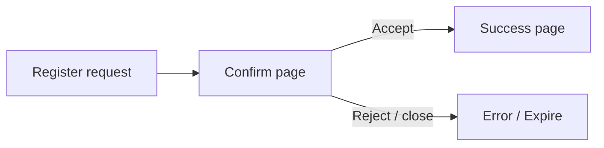
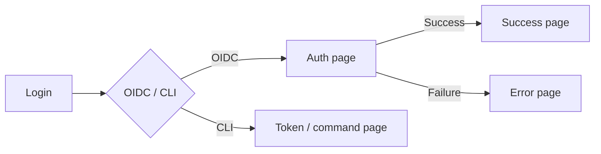
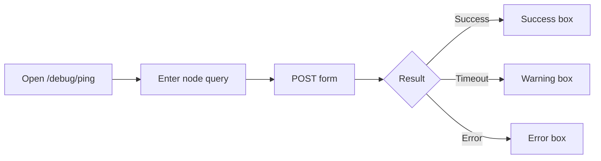

---
hide:
  - toc
---

# Headscale UI Guide

This guide provides visual references and flow diagrams for the Headscale
user interface. It is intended for contributors and maintainers who need
to understand, update, or test the UI.

> **Note:** This document contains placeholders for screenshots and
> diagrams. When the UI changes, contributors should update the
> corresponding images to keep this guide accurate.

---

## UI Screenshots

Screenshots are stored under
[`docs/assets/screenshots/`](../assets/screenshots/). Each page or feature
has its own subdirectory when needed.

### How to take and update screenshots

1. Use a consistent browser (Chrome/Firefox latest) and OS (Linux/macOS).
2. Capture both **desktop** and **mobile** views where relevant.
   - Desktop: viewport at least 1280×800 px.
   - Mobile: viewport 375×812 px (iPhone X size).
3. Name files clearly, e.g.:
   - `ping-default-desktop.png`
   - `ping-error-mobile.png`
   - `register-confirm-default-desktop.png`
4. When you make a UI change, update the affected screenshots in the same
   pull request.

### Pages and states

<!--
  Contributors: replace each placeholder with the actual screenshot.
  Use the pattern:
    
-->

#### Apple Configuration (`/apple`)

| State     | Desktop | Mobile |
|-----------|---------|--------|
| Default   | _Screenshot placeholder_ | _Screenshot placeholder_ |

#### Windows Configuration (`/windows`)

| State     | Desktop | Mobile |
|-----------|---------|--------|
| Default   | _Screenshot placeholder_ | _Screenshot placeholder_ |

#### Authentication Success

| State     | Desktop | Mobile |
|-----------|---------|--------|
| Default   | _Screenshot placeholder_ | _Screenshot placeholder_ |

#### Authentication Error

| State     | Desktop | Mobile |
|-----------|---------|--------|
| Default   | _Screenshot placeholder_ | _Screenshot placeholder_ |

#### Ping / Debug (`/debug/ping`)

| State     | Desktop | Mobile |
|-----------|---------|--------|
| Default (no result) | _Screenshot placeholder_ | _Screenshot placeholder_ |
| Success (pong) | _Screenshot placeholder_ | _Screenshot placeholder_ |
| Error / Timeout | _Screenshot placeholder_ | _Screenshot placeholder_ |

#### Registration Confirmation (`/register/confirm`)

| State     | Desktop | Mobile |
|-----------|---------|--------|
| Default   | _Screenshot placeholder_ | _Screenshot placeholder_ |

---

## UI Flow Diagrams

Diagrams are stored under
[`docs/assets/diagrams/`](../assets/diagrams/). They illustrate the main
user-facing flows.

### How to create and update diagrams

1. Use **Mermaid** (native mkdocs support) for inline diagrams, or
   draw.io / similar for complex flows.
2. Save source files alongside the rendered PNG/SVG when possible.
3. Update diagrams when the corresponding user flow changes.

### Device registration flow



### Authentication flow



### Ping / Debug flow



---

## Contributing to this guide

- **Add a new page:** Follow the table format in [Pages and states](#pages-and-states).
  Add the screenshot files and update the table.
- **Update a screenshot:** Replace the file in
  `docs/assets/screenshots/` and keep the same filename if the content
  hasn't changed structurally.
- **Update a diagram:** Edit the Mermaid block or replace the file in
  `docs/assets/diagrams/`.
- **Reference screenshots in other docs:** Use relative links:
  ```markdown
  
  ```

### Maintenance checklist

Before each release, verify that:

- [ ] All screenshots reflect the current UI.
- [ ] No broken image links exist.
- [ ] Flow diagrams match the current user experience.
- [ ] Any new UI pages or states are documented.
