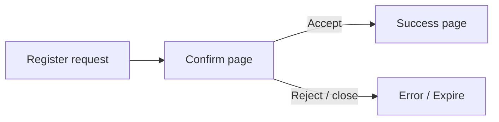
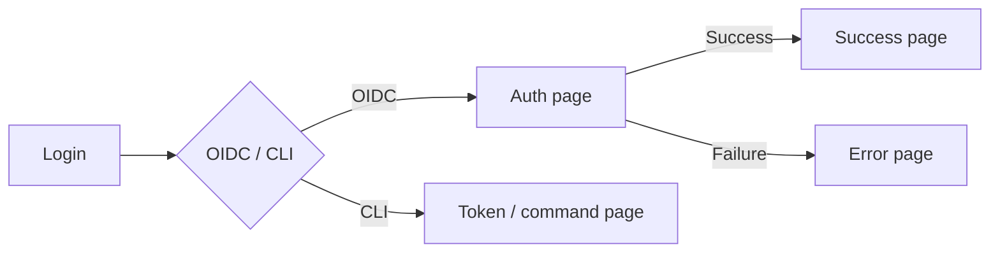
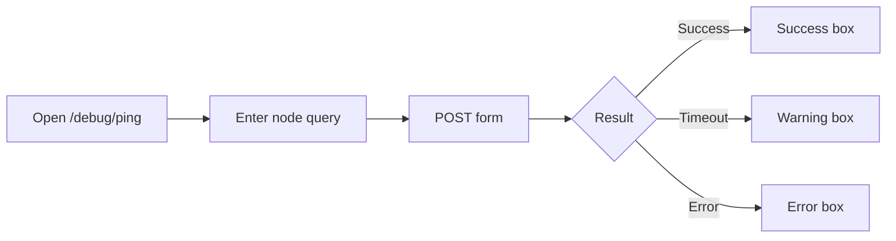

---
hide:
  - toc
---

# Headscale UI Guide

This guide provides visual references and flow diagrams for the Headscale
user interface. It is intended for contributors and maintainers who need
to understand, update, or test the UI.

> **Note:** Screenshots in this guide are tracked as a [maintenance task](https://github.com/arsydoni4326-alt/headscale/issues). When the UI changes, contributors should update the corresponding images to keep this guide accurate. See [How to take and update screenshots](#how-to-take-and-update-screenshots) below.

---

## UI Screenshots

Screenshots are stored under
[`docs/assets/screenshots/`](../assets/screenshots/). Each page or feature
has its own subdirectory when needed.

### How to take and update screenshots

1. Use a consistent browser (Chrome/Firefox latest) and OS (Linux/macOS).
2. Capture both **desktop** and **mobile** views where relevant.
   - Desktop: viewport at least 1280×800 px.
   - Mobile: viewport 375×812 px (iPhone X size).
3. Name files clearly, e.g.:
   - `ping-default-desktop.png`
   - `ping-error-mobile.png`
   - `register-confirm-default-desktop.png`
4. When you make a UI change, update the affected screenshots in the same
   pull request.

### Pages and states

<!--
  Contributors: replace each placeholder with the actual screenshot.
  Use the pattern:
    
-->

#### Apple Configuration (`/apple`)

| State     | Desktop | Mobile |
|-----------|---------|--------|
| Default   | _Screenshot placeholder_ | _Screenshot placeholder_ |

#### Windows Configuration (`/windows`)

| State     | Desktop | Mobile |
|-----------|---------|--------|
| Default   | _Screenshot placeholder_ | _Screenshot placeholder_ |

#### Authentication Success

| State     | Desktop | Mobile |
|-----------|---------|--------|
| Default   | _Screenshot placeholder_ | _Screenshot placeholder_ |

#### Authentication Error

| State     | Desktop | Mobile |
|-----------|---------|--------|
| Default   | _Screenshot placeholder_ | _Screenshot placeholder_ |

#### Ping / Debug (`/debug/ping`)

| State     | Desktop | Mobile |
|-----------|---------|--------|
| Default (no result) | _Screenshot placeholder_ | _Screenshot placeholder_ |
| Success (pong) | _Screenshot placeholder_ | _Screenshot placeholder_ |
| Error / Timeout | _Screenshot placeholder_ | _Screenshot placeholder_ |

#### Registration Confirmation (`/register/confirm`)

| State     | Desktop | Mobile |
|-----------|---------|--------|
| Default   | _Screenshot placeholder_ | _Screenshot placeholder_ |

---

## UI Flow Diagrams

Diagrams are stored under
[`docs/assets/diagrams/`](../assets/diagrams/). They illustrate the main
user-facing flows.

### How to create and update diagrams

1. Use **Mermaid** (native mkdocs support) for inline diagrams, or
   draw.io / similar for complex flows.
2. Save source files alongside the rendered PNG/SVG when possible.
3. Update diagrams when the corresponding user flow changes.

### Device registration flow


```mermaid
flowchart LR
    A[Register request] --> B[Confirm page]
    B -->|Accept| C[Success page]
    B -->|Reject / close| D[Error / Expire]
```

### Authentication flow


```mermaid
flowchart LR
    A[Login] --> B{OIDC / CLI}
    B -->|OIDC| C[Auth page]
    C -->|Success| D[Success page]
    C -->|Failure| E[Error page]
    B -->|CLI| F[Token / command page]
```

### Ping / Debug flow


```mermaid
flowchart LR
    A[Open /debug/ping] --> B[Enter node query]
    B --> C[POST form]
    C --> D{Result}
    D -->|Success| E[Success box]
    D -->|Timeout| F[Warning box]
    D -->|Error| G[Error box]
```

---

## Accessibility Features

Headscale's web interfaces (both backend-served templates and the Headplane
UI) are designed to be accessible to all users. This section documents the
accessibility features and provides guidance for contributors.

### Keyboard Navigation

All interactive elements can be accessed and operated using only a keyboard:

- **Tab / Shift+Tab** — Navigate between interactive elements
- **Enter / Space** — Activate buttons, links, and form controls
- **Arrow keys** — Navigate within select menus, radio groups, and custom controls
- **Esc** — Close modals and dialogs

All interactive elements have visible focus indicators (rings) to show the
current keyboard focus position.

### Screen Reader Support

All UI elements provide appropriate semantic information for screen readers:

- **Semantic HTML** — Proper use of `<button>`, `<form>`, `<nav>`, heading hierarchy
- **ARIA labels** — All icon-only buttons and controls have accessible names via `aria-label`
- **ARIA roles** — Dynamic content uses `role="alert"` and `aria-live` for announcements
- **Alternative text** — Images and icons have descriptive text or are marked decorative with `aria-hidden="true"`

### Visual Accessibility

- **Color contrast** — All text and interactive elements meet WCAG 2.1 AA contrast requirements (4.5:1 for normal text, 3:1 for large text)
- **Dark mode** — Full dark mode support with appropriate contrast in both themes
- **Focus indicators** — High-visibility focus rings on all interactive elements
- **Link styling** — Links are underlined to avoid relying on color alone
- **Touch targets** — Interactive elements meet minimum size requirements (44×44px on mobile)

### Forms and Validation

- **Associated labels** — All form inputs have visible labels or `aria-label` attributes
- **Error messages** — Validation errors are announced to screen readers via `aria-live` regions
- **Required fields** — Required inputs are marked and announced appropriately
- **Placeholder text** — Used only for hints, never as the sole label

### Testing

The Headplane UI includes automated accessibility testing:

- **axe-core** — Automated scans for critical and serious WCAG violations in CI/CD
- **Playwright e2e tests** — Include accessibility checks on all major pages
- **Component tests** — Verify keyboard navigation, focus management, and ARIA attributes

### Known Limitations

- **Full WCAG validation** — Automated testing catches many issues, but full WCAG 2.1 AA conformance requires manual testing with assistive technologies
- **Dynamic content** — Some complex interactions (drag-and-drop in topology view) may have reduced screen reader support
- **Third-party components** — Some upstream components (`@base-ui/react`) use non-standard patterns (e.g., `aria-disabled` instead of `disabled` attribute)

### Reporting Accessibility Issues

If you encounter an accessibility barrier, please report it via the
[GitHub issue tracker](https://github.com/arsydoni4326-alt/headscale/issues).
Include:

- Description of the issue
- The page/component affected
- Your assistive technology (screen reader, keyboard-only navigation, etc.)
- Steps to reproduce
- Expected behavior

---

## Contributing to this guide

- **Add a new page:** Follow the table format in [Pages and states](#pages-and-states).
  Add the screenshot files and update the table.
- **Update a screenshot:** Replace the file in
  `docs/assets/screenshots/` and keep the same filename if the content
  hasn't changed structurally.
- **Update a diagram:** Edit the Mermaid block or replace the file in
  `docs/assets/diagrams/`.
- **Reference screenshots in other docs:** Use relative links:
  ```markdown
  
  ```

### Maintenance checklist

Before each release, verify that:

- [ ] All screenshots reflect the current UI.
- [ ] No broken image links exist.
- [ ] Flow diagrams match the current user experience.
- [ ] Any new UI pages or states are documented.
- [ ] Accessibility features remain functional and documented.
